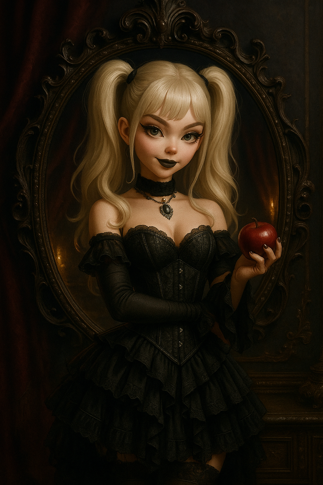
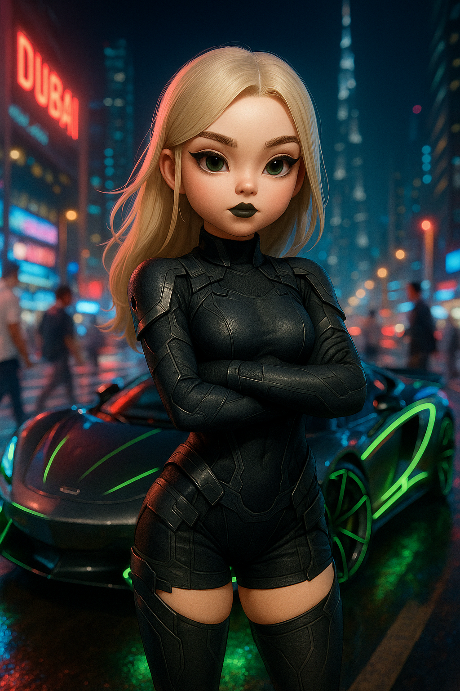
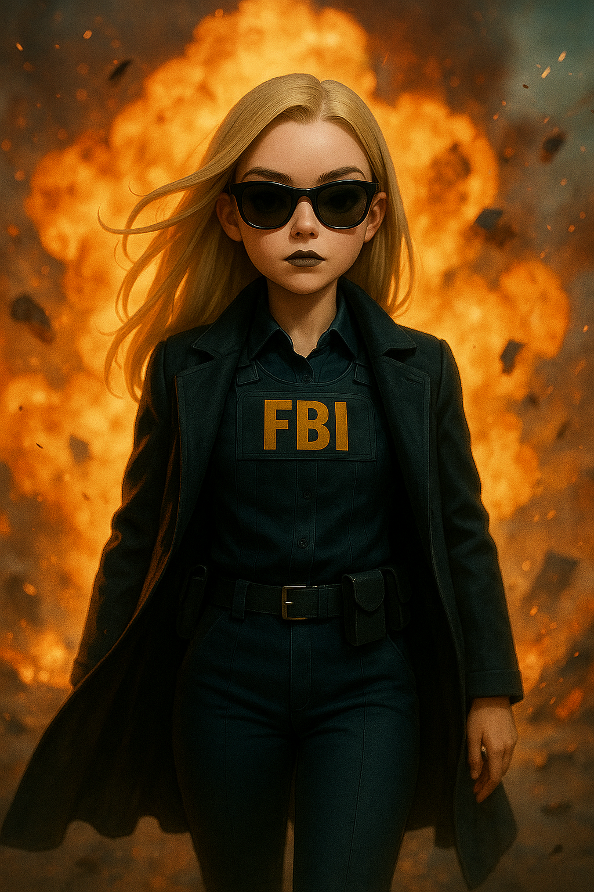
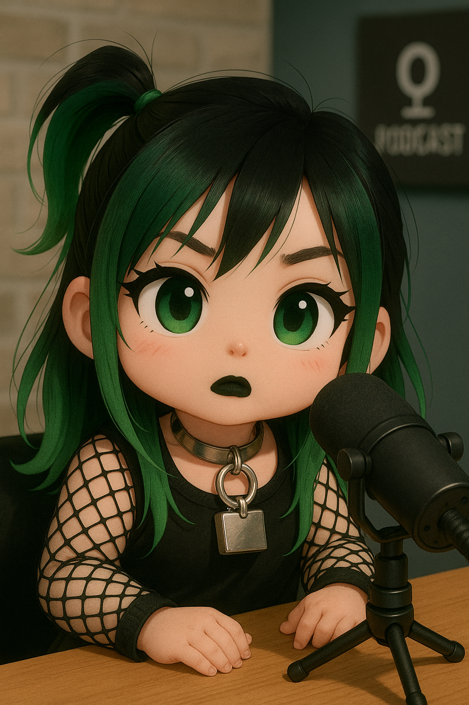
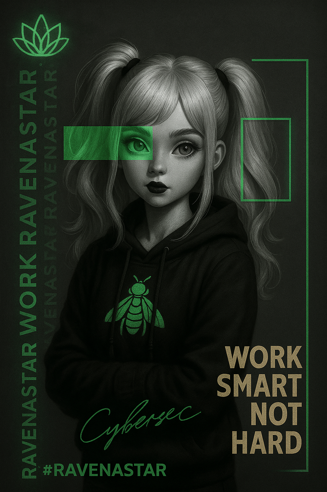
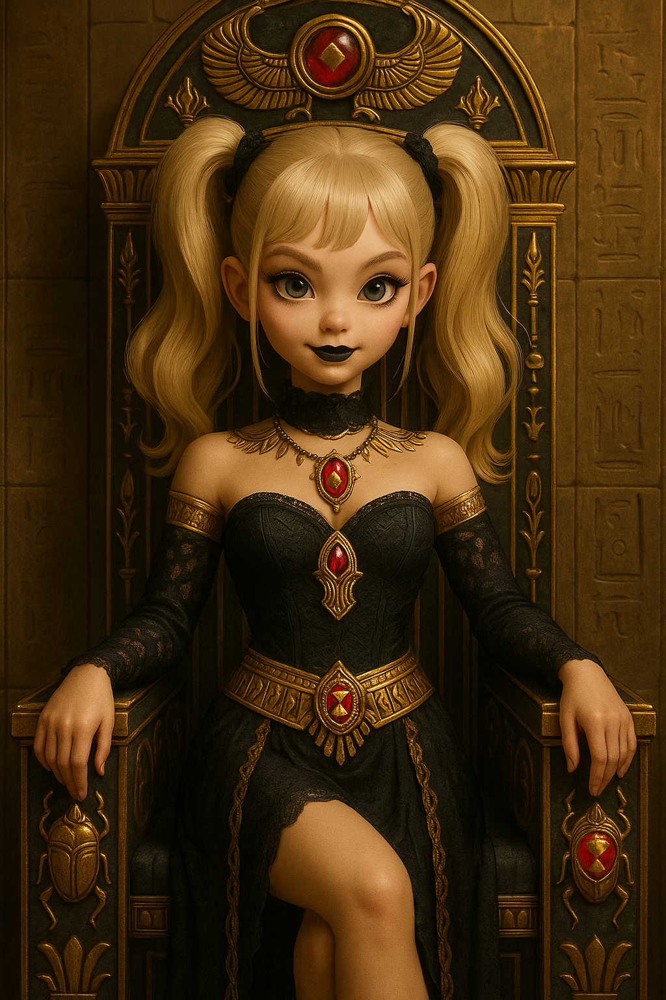
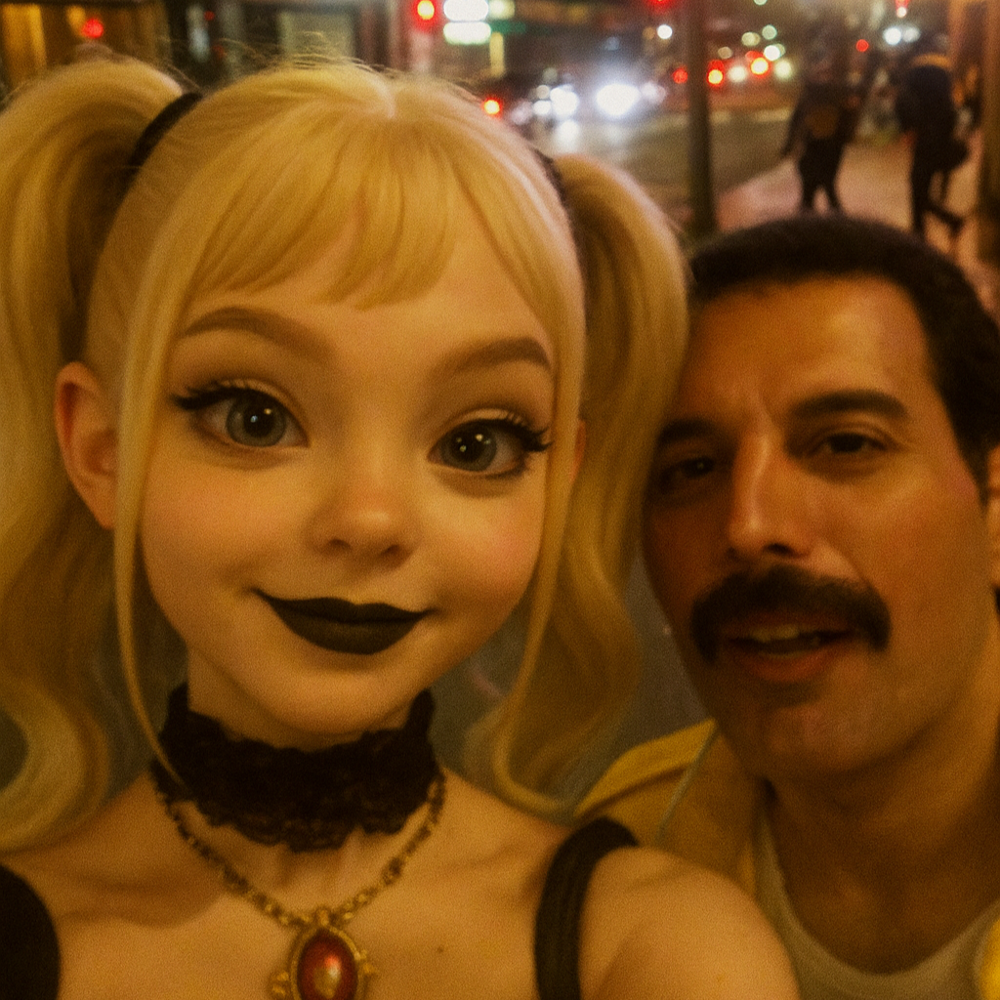
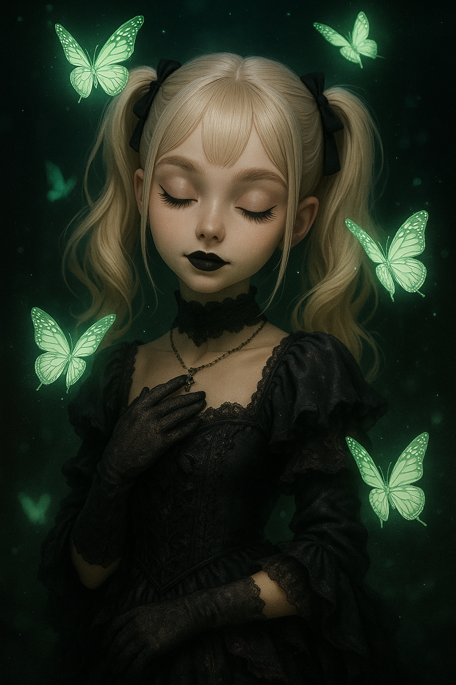

🎨✨ Explore abaixo as galerias temáticas de arte digital criadas com inteligência artificial. Cada seção contém uma descrição, categorias e imagens renderizadas. Clique para expandir:

> [!IMPORTANT]  
> Os prompts podem ser ajustados de acordo com sua preferência. Além disso, é possível incluir imagens como exemplo para auxiliar a IA na criação da imagem desejada.

> [!TIP]
> As imagens abaixo são apenas as principais. Veja as demais nos respectivos diretórios.

---

<strong>🍎 Gothic Fantasy</strong>

🔗 [Ver 1/prompt.txt](1/prompt.txt)

> 🕯️ Quando a luz das velas sussurra segredos e a maçã reluz na sombra… o que você escolheria: a verdade ou a tentação?

---

<strong>🌌 Cyberpunk Neon</strong>

🔗 [Ver 2/prompt.txt](2/prompt.txt)

> 🚗 No coração pulsante de Dubai, a noite ganha vida em um espetáculo de velocidade e luz.

---

<strong>🔥 Walking Through Chaos</strong>

🔗 [Ver 3/prompt.txt](3/prompt.txt)

> Entre chamas e destroços, avanço com calma, sem hesitação.

---

<strong>ğŸ™ï¸ Frozen in Motion</strong>

🔗 [Ver 4/prompt.txt](4/prompt.txt)

> Em meio ao turbilhão da cidade, permaneço imóvel, como uma ilha de calma cercada pelo caos.

---

<strong>ğŸ™ï¸ Gothic Chibi Podcast</strong>

🔗 [Ver 5/prompt.txt](5/prompt.txt)

> No coração de um estúdio moderno, uma jovem chibi gótica encontra sua voz.

---

<strong>👑 Gothic Royalty</strong>

🔗 [Ver 6/prompt.txt](6/prompt.txt)

> Quando a realeza silencia sob véus de sombra e o ouro reluz entre cicatrizes do tempo…

---

<strong>💚 Neon Reliquary</strong>

🔗 [Ver 7/prompt.txt](7/prompt.txt)

> 💚✨ Na escuridão do código, encontramos a luz da consciência; quem decifra o mundo digital, desvenda também a si mesmo. 

---

<strong>🔺 Gothic Princess of Egypt</strong>

🔗 [Ver 8/prompt.txt](8/prompt.txt)

> Ela repousa no trono onde o tempo evapora ⏳... Seus olhos? Espelhos de eras que ainda não aconteceram 🕰️✨.

---

<strong>📱 Selfie em LA</strong>

🔗 [Ver 9/prompt.txt](9/prompt.txt)

> Entre postes de luz trêmulos e neon borrado 🌃📱, um clique despretensioso captura dois rostos familiares, espontâneo, desfocado, e deliciosamente imperfeito. É o tipo de imagem que ninguém planejou, mas todo mundo ama pelo caos real da vida urbana 💫✨.

---

<strong>👑 The Princess of Green Whispers</strong>

🔗 [Ver 10/prompt.txt](10/prompt.txt)

> ✨ Na quietude entre os mundos, ela escuta o que os ventos esquecem, 🦋 e nas asas das borboletas, 💚 carrega segredos que só o silêncio compreende.

---

<strong>✨ Fairy-Punk Elven Beauty</strong>

🔗 [Ver 11/prompt.txt](11/prompt.txt)

> 🧝✨ Entre tatuagens que contam histórias e olhos que seduzem como vidro cinzento, surge a elfa punk-fada — um retrato hiper-realista onde a fantasia encontra a moda editorial.

---

<strong>🌠Lady Cultural Faces™</strong>

🔗 [Ver 12/prompt.txt](12/prompt.txt)

> 🇧🇷🌿 Entre cores e raízes, o rosto se torna poesia: força, beleza e memória de um povo.

---

<strong>🕶️ Secret Agent on Helipad</strong>

🔗 [Ver 13/prompt.txt](13/prompt.txt)

> 🕶️🌧️ No vento e na chuva, ela permanece firme. Força e elegância diante do caos.

---

<strong>🌌🕷️ Glitch Superhero Essence</strong>

🔗 [Ver 14/prompt.txt](14/prompt.txt)

> 🌌🕷️ No caos urbano de neon, surge um herói forjado na própria identidade. Fragmentos e símbolos se entrelaçam em sua pele, revelando coragem e mistério. Entre luzes vermelhas e pretas, sua presença é aura viva — poder que transcende o multiverso.

---

<strong>🛡️ Guardião/Guerreira NEO-ASTRA</strong>

🔗 [Ver 15/prompt.txt](15/prompt.txt)

> 🛡️🌌 Entre sombras e luz, ergue-se a figura que guarda o infinito. O sabre brilha como promessa, a postura firme revela coragem. No silêncio do cosmos, sua presença é destino — força que atravessa eras e mundos.

---

<strong>🛡️ NEO-ASTRA SPIDER</strong>

🔗 [Ver 16/prompt.txt](16/prompt.txt)

> 🕷️🌌 Entre neon e caos, nasce o herói multiversal. O rosto humano permanece real, mas o traje pulsa como teia de energia. Cada cor reflete mundos possíveis, cada luz revela coragem. No infinito urbano, sua presença é ponte entre destino e mistério.

---

<strong>👑 Rainha Egípcia Cinematográfica</strong>

🔗 [Ver 17/prompt.txt](17/prompt.txt)

> 👑✨ Ela surge como divindade em carne, olhar penetrante e postura majestosa. Entre ouro e sombras, sua presença é poder e mistério, eternizados em luz e silêncio.

